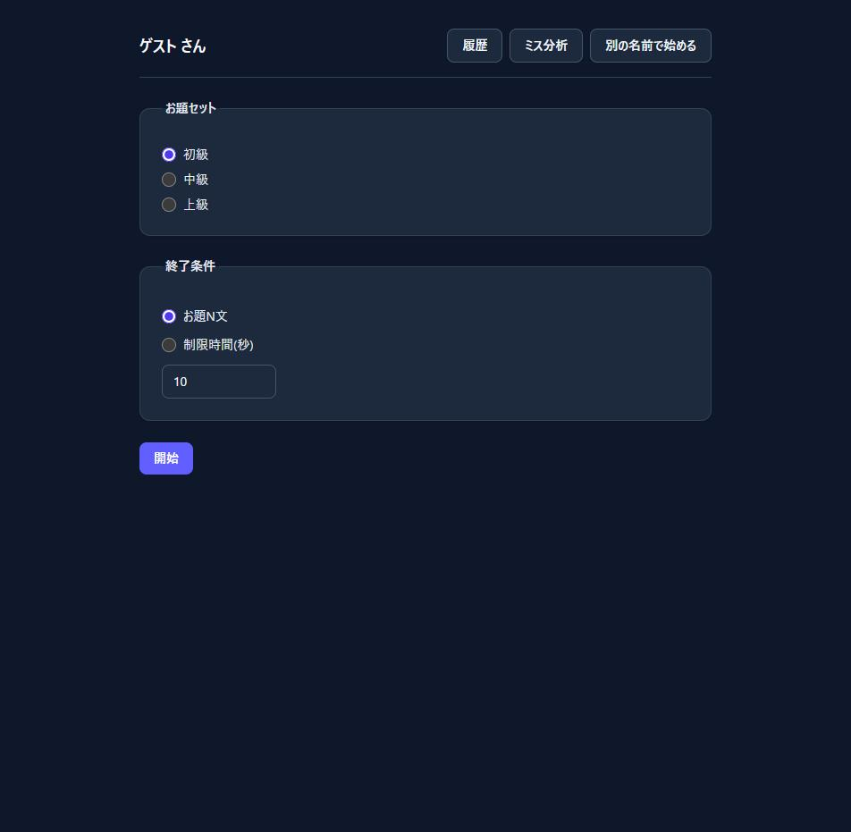
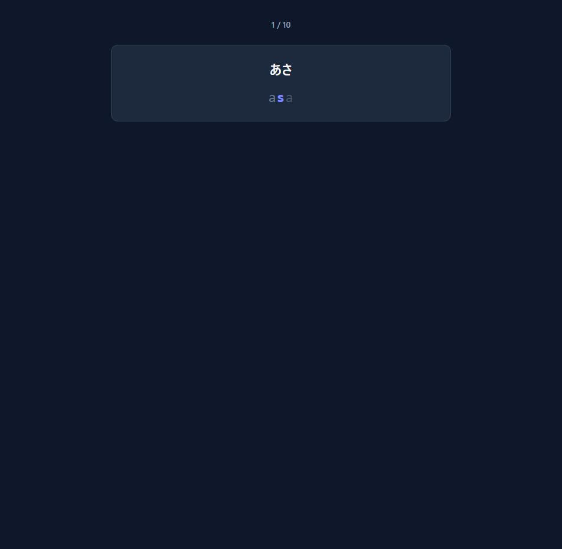

# タイピング練習

日本語のお題文をローマ字入力で練習できる、個人学習用のタイピング練習アプリ。清音の複数表記(し=si/shi/ci)・拗音・促音・撥音「ん」・長音まで判定し、セッションごとの記録(KPM・正確率・Consistency)を保存してミス傾向を分析する。

## 目次

- [このプロジェクトについて](#このプロジェクトについて)
- [公開URL](#公開url)
- [スクリーンショット](#スクリーンショット)
- [主な機能](#主な機能)
- [技術スタック](#技術スタック)
- [ローカルでの起動方法](#ローカルでの起動方法)
- [テストの実行](#テストの実行)
- [ドキュメント](#ドキュメント)

## このプロジェクトについて

[Claude Code](https://claude.com/claude-code)(Anthropic)と協業しながら開発した個人学習プロジェクト。要件定義→設計→実装→テスト→リリースというウォーターフォール型の工程をベースに、意思決定はKazukiが行い、ドラフト作成や実装はClaudeが担当する形でやり取りを重ねて完成させた。見積もりと実績のズレ率を毎セッション記録し、AIとの協業でどれくらいの精度で見積もれるかも検証している。開発の詳しい記録は[progress.md](./progress.md)、見積もり/実績の記録は[estimate-actual.md](./docs/00_project/estimate-actual.md)を参照。

## 公開URL

- フロントエンド: https://typing-app-1-jofu.onrender.com
- バックエンド: https://typing-app-xvkn.onrender.com

Render無料枠でホスティングしているため、しばらくアクセスが無いとスリープし、初回アクセス時の起動に時間がかかることがある。

## スクリーンショット

<p align="center">
  
  
</p>

左: お題セット・終了条件を選ぶホーム画面。右: 確定済み文字(グレー)・入力中の文字(インディゴ)・次に打つ文字のヒント(薄いグレー)を色分け表示するタイピング画面。

## 主な機能

- お題文のローマ字判定・リアルタイム表示(確定文字/次に打つ文字/ミス位置)
- セッション実行(お題N文 または 制限時間で終了)
- 結果算出(Net KPM・Raw KPM・正確率・Consistency)、自己ベスト表示
- 履歴一覧
- ミス傾向分析(かな別/誤りパターン別/直前のかな別/文字種別)+ 改善アドバイス
- お題セット管理(難易度別、DB保持)

認証機能は無く、利用者識別は名前入力のみ([ADR-001](./docs/00_project/decisions/001-auth-out-of-scope.md))。

## 技術スタック

| 分類 | 技術 |
|---|---|
| フロントエンド | Vue 3 + Vite + TypeScript + Pinia + vue-router + Tailwind CSS |
| バックエンド | Java 25 + Spring Boot 4.1.1(Maven マルチモジュール) |
| DB | PostgreSQL 16 + Flyway |
| テスト | Vitest(frontend)、JUnit 5(backend)、Playwright(E2E) |
| デプロイ | Render(Docker) |

## ローカルでの起動方法

前提: Docker、Java 25、Node.js。

```bash
# 1. DB起動
docker compose up -d

# 2. バックエンド起動(別ターミナル)
cd backend/api
mvn spring-boot:run

# 3. フロントエンド起動(別ターミナル)
cd frontend
npm install
npm run dev
```

`http://localhost:5173`(使用中の場合はポート番号が繰り上がる)にアクセスする。

## テストの実行

```bash
# backend(typing-core + api)
cd backend
mvn test

# frontend(単体・コンポーネント)
cd frontend
npm run test

# frontend(E2E、backend/frontendの起動が必要)
npm run test:e2e
```

## ドキュメント

このプロジェクトはウォーターフォール型の工程(要件定義〜テスト〜リリース)で開発しており、成果物一式は [docs/](./docs/_index.md) にある。工程の全体像は [workflow.md](./workflow.md)、現在の進捗は [progress.md](./progress.md) を参照。
