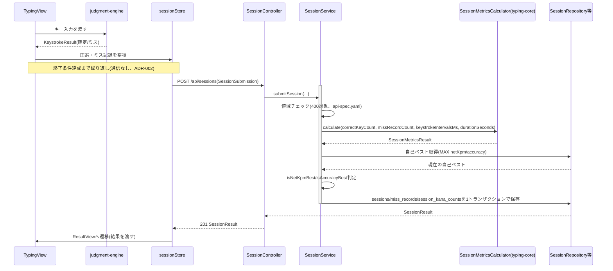
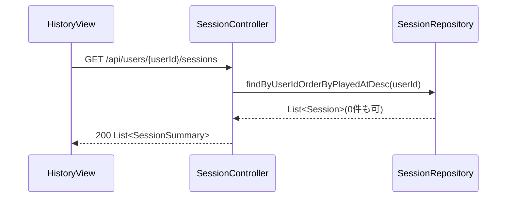
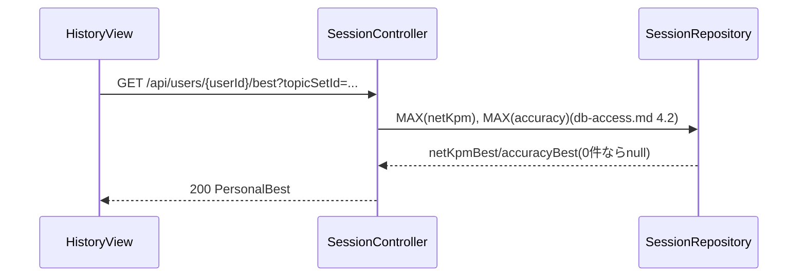
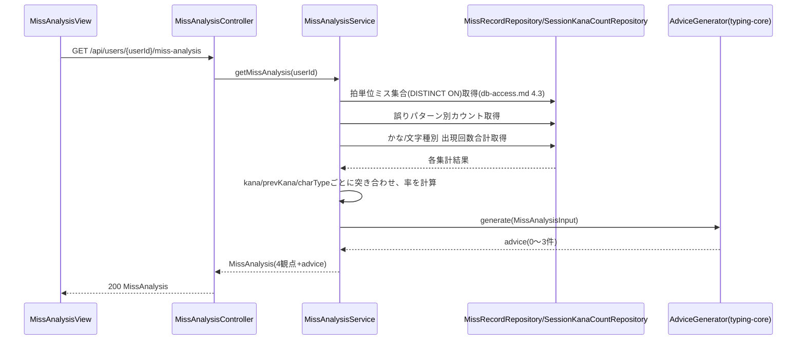
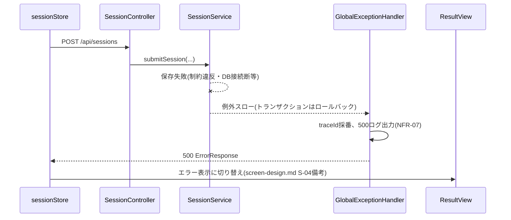
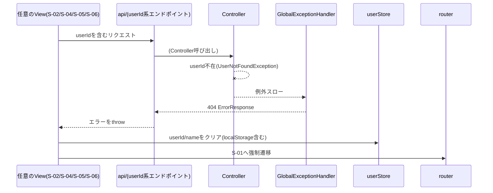

# シーケンス図

`class-design.md`・`db-access.md` で確定したクラス・クエリを、実際の呼び出し順序として整理する。クラス名は `class-design.md` と同じものを使う。

---

## 1. セッション実行〜結果保存(正常系、FR-04〜09)

`Svc→Repo`の保存3行は `@Transactional` の1トランザクション内(`db-access.md` 5章)。

## 2. 履歴一覧取得(FR-08)

## 3. 自己ベスト取得(FR-09)

## 4. ミス分析・改善アドバイス取得(FR-10, FR-11)

---

## 5. エラー系

### 5.1 DB障害時(NFR-09、セッション保存失敗)

### 5.2 利用者未存在時(ADR-003、userId系APIで404)

`screen-design.md` 2章の「userIdが存在しないとき」の導線を、呼び出し元(どのViewからでも共通処理として発火する)として明確化した。具体的な実装(共通エラーハンドラをどこに置くか)はP5で決める。

---

## 6. 未決事項

なし。
