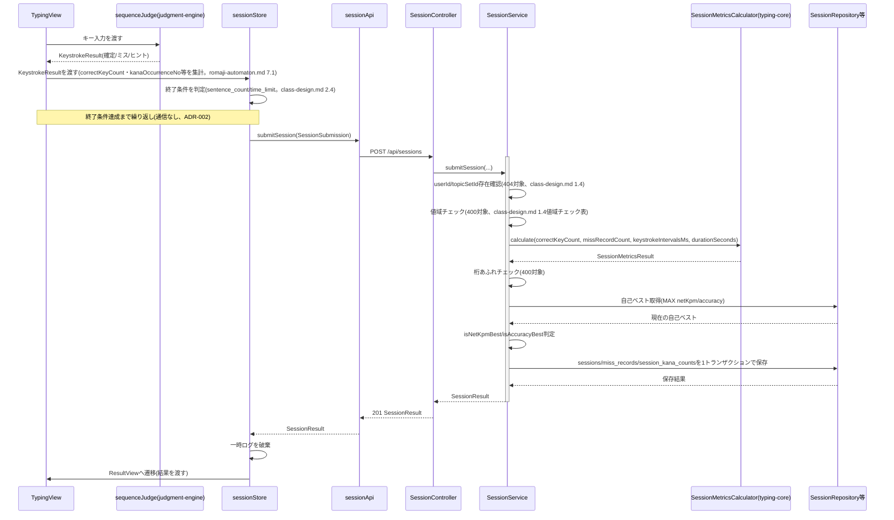
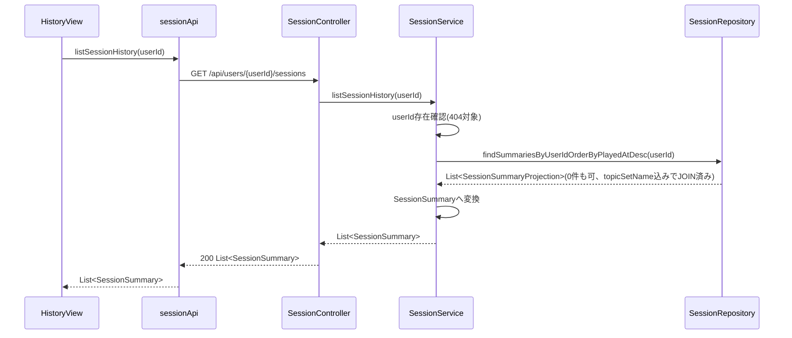
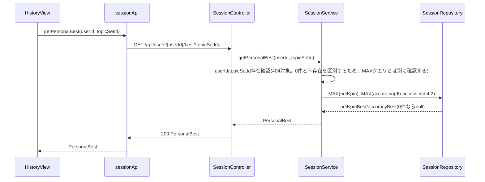
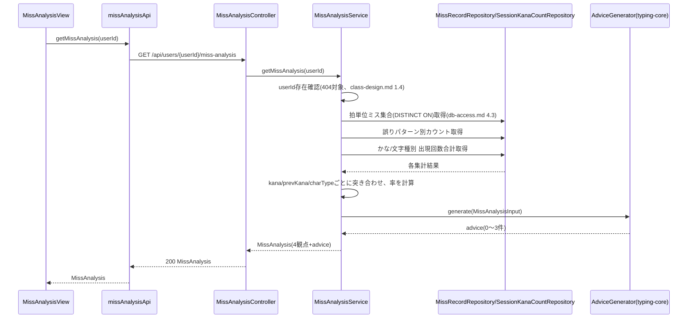
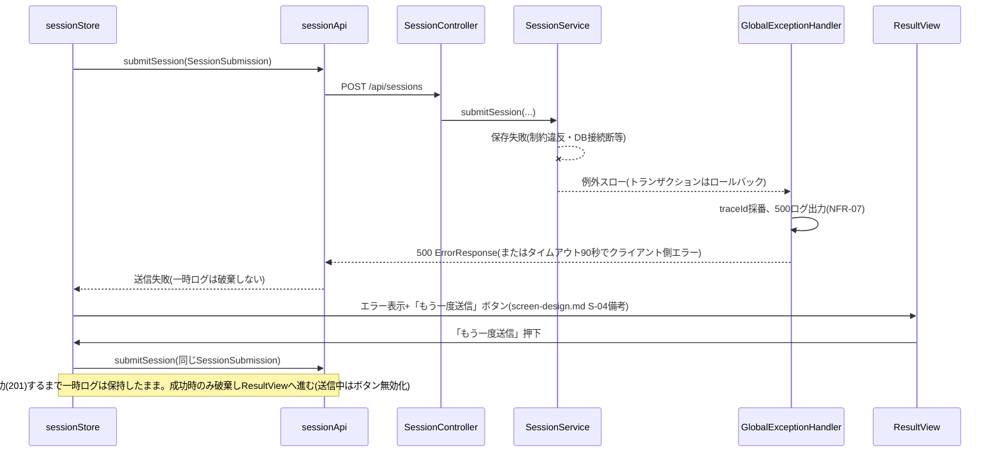
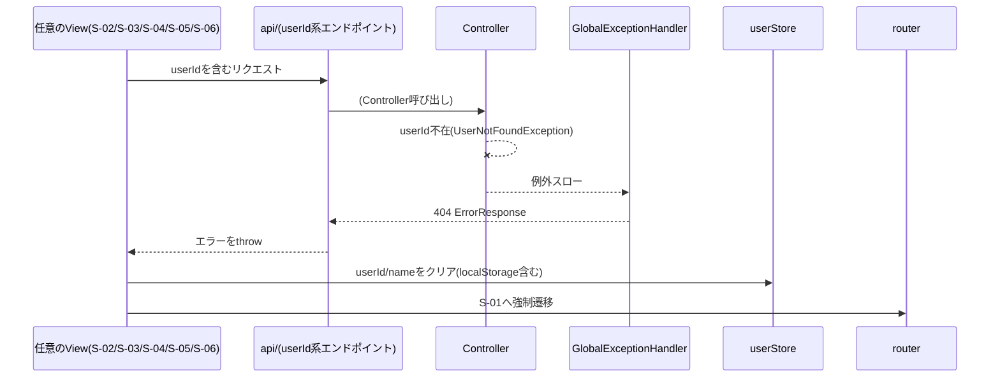
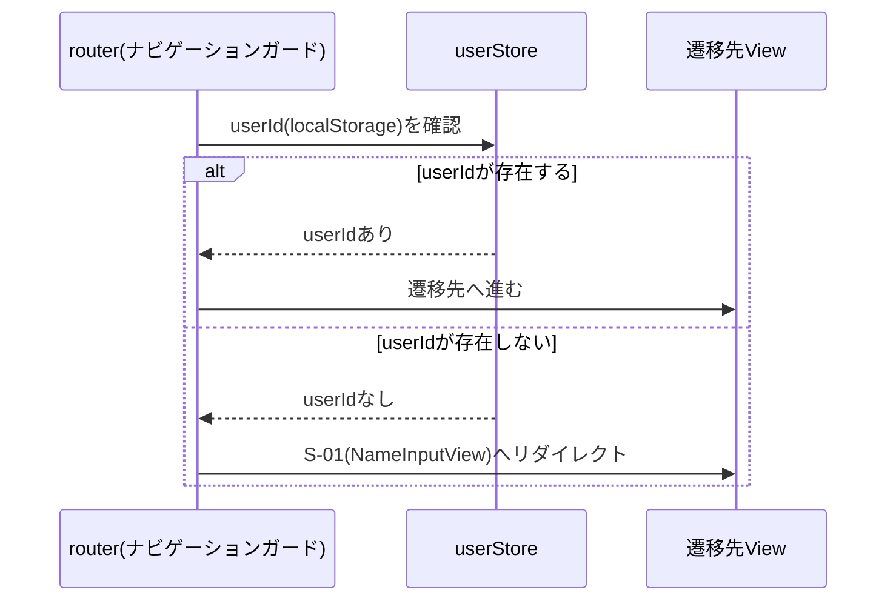

# シーケンス図

`class-design.md`・`db-access.md` で確定したクラス・クエリを、実際の呼び出し順序として整理する。クラス名は `class-design.md` と同じものを使う。

---

## 1. セッション実行〜結果保存(正常系、FR-04〜09)

`Svc→Repo`の保存3行は `@Transactional` の1トランザクション内(`db-access.md` 5章)。送信失敗時の扱いは5.1参照。

## 2. 履歴一覧取得(FR-08)

## 3. 自己ベスト取得(FR-09)

## 4. ミス分析・改善アドバイス取得(FR-10, FR-11)

---

## 5. エラー系

### 5.1 送信失敗時(DB障害・タイムアウト等、NFR-09/ops-reviewer A1対応)

### 5.2 利用者未存在時(ADR-003、userId系APIで404)

`screen-design.md` 2章の「userIdが存在しないとき」の導線を、呼び出し元(どのViewからでも共通処理として発火する)として明確化した。具体的な実装(共通エラーハンドラをどこに置くか)はP5で決める。

### 5.3 起動時のuserId復元とルーターガード(2026-08-29、ゲート③ doc-reviewer A6対応)

`class-design.md` 2.7が本ファイルへ委譲していた遷移ガードを確定する。5.2はAPIが404を返した(userIdが失効していた)場合の導線であるのに対し、こちらは`screen-design.md` 2章のもう一方の導線(起動時にlocalStorageの値が無い場合)を扱う。

**userIdあり かつ 遷移先がS-01の場合(P3ゲート③検証レビューverify-C4対応):** このガードは「userIdが無ければS-01へ送る」動作のみを行い、逆方向(userIdがあるのにS-01への遷移を止める)は行わない。そのため「別の名前で始める」(`handleChangeName`、`userStore.clearUser()`実行後にS-01へ`push`)経由でのS-01遷移はuserIdが既にクリアされた後なので通常どおりガードを通過する。ルート(`/`)への直接アクセス時にuserIdがある状態でS-02へ送り返す挙動は、このガードの対象外であり実装していない(MVPでは`/`にnameInputViewを直接割り当てているため、再訪問時も名前入力画面が表示されるが、実害は「名前を入力し直すだけ」で軽微と判断)。

---

## 6. 未決事項

なし。共通エラーハンドラ(5.2)の物理的な実装配置は、P5では見送られたままP6-04(ST-010着手時)まで気づかれず未実装だったため、P6-04で解決した(CL-028)。`frontend/src/api/errorHandling.ts`の`handleUserNotFound(error, router)`を各View(`HistoryView`/`MissAnalysisView`)のcatchブロックから呼ぶ方式。

**2026-09-12追記(P6完了確認時の`/code-review`で発見・修正、CL-029):** CL-028時点ではS-04(ResultView)がAPI呼び出し元ではなく`sessionStore.submit()`(Piniaストア)経由でAPIを呼ぶ構造だったため対応が漏れていた(`sequence.md`の対象Viewには元々S-04も明記されていたが、実装時に見落とされた)。`sessionStore.submit()`/`endSession()`が`router`を引数に取り、内部で`handleUserNotFound`を呼ぶ方式に変更して解決。ストアがuserId失効を処理した場合は`true`を返し、呼び出し元View(`TypingView`/`ResultView`)はtrueの間は続けて別画面へ遷移しない(S-01への強制遷移を上書きしないため)。
